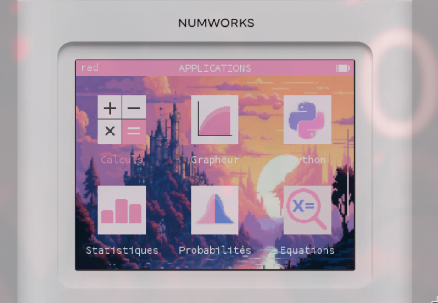
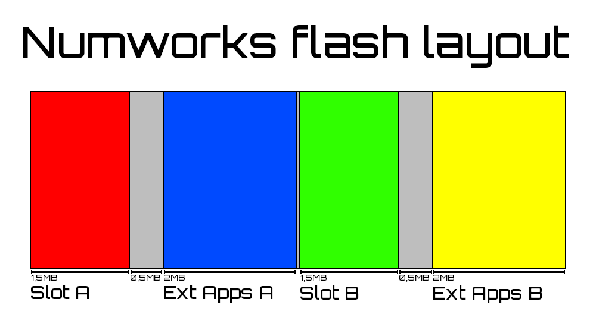

# Salty-OS

Salty-OS is a custom userland for the numworks calculator based on the latest published version of [epsilon](https://github.com/Numworks/epsilon).

# Explanation

A userland is not an OS, it has more restrictions.

NumWorks calculators boot slot A by default, then you can access Slot B with a launcher (ex: [ABLaucher](https://github.com/SaltyMold/ABLauncher-Numworks)).

If the userland crashes or if you reset it, the calculator falls back to booting slot A, but slot B isn't wiped in the process, so the custom userland is still there and can be re-launched afterward (at least on latest versions of epsilon).

This has only been tested on the `n0120`  so far. If you try it on another model, please open an issue to report whether it worked or not.

The pythons scripts are in ram, so the layout of the external flash can't affect them.
The bootloader is in another flash, the internal flash.

See more at https://nwagyu.org/reference/firmware/

# Functionalities

The userland is build with onboarding disabled and external apps allowed.

For now, there is not much. But updates will come soon so stay tuned!

### Current

- A custom image wallpaper.
- Custom icons. 
- Custom color theme.

All three currently require rebuilding the userland to change. A simpler customization method is planned for a future update.

### Upcomming

- Customizable icon form.

# How to install

### Userland

- Download the right and latest `dfu` file from the [releases](https://github.com/SaltyMold/Salty-OS/releases/) for your calculator.
- Go to [Custom userland installer numworks](https://saltymold.github.io/Custom-Userland-Installer-Numworks/).
- Connect your calculator.
- Send your `dfu` file.
- Click install.

### Launcher

- Download the latest `nwa` app from [ABLaucher releases](https://github.com/SaltyMold/ABLauncher-Numworks/releases/).
- Go to [Numworks app installer](https://my.numworks.com/apps), make sure to login.
- Connect your calculator.
- Send your `nwa` app.
- Click install.

Open the app and press exe, you should now be in Salty-OS. If it crashes, retry.