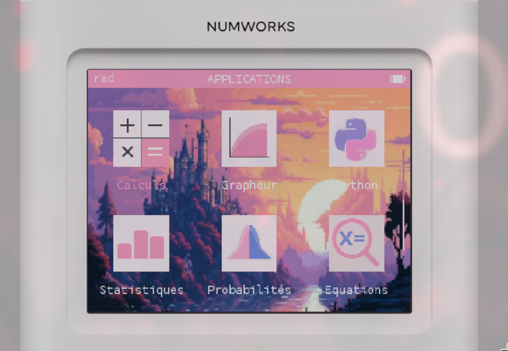
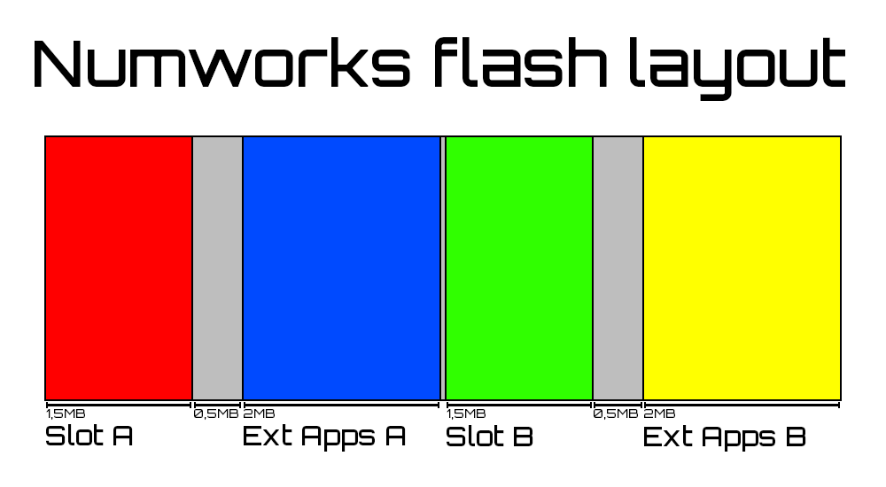

<p align="center"></p>

Salty-OS is a custom userland for the numworks calculator based on the latest published version of [epsilon](https://github.com/Numworks/epsilon) (25.2.2).



# Explanation

A userland is not an OS, it has more restrictions.

NumWorks calculators boot slot A by default, then you can access Slot B with a launcher (ex: [ABLaucher](https://github.com/SaltyMold/ABLauncher-Numworks)).

If the userland crashes or if you reset it, the calculator falls back to booting slot A, but slot B isn't wiped in the process, so the custom userland is still there and can be re-launched afterward (at least on latest versions of epsilon).

This has been tested on the `n0120` with epsilon `26.3.0` so far. If you try it on another model, please open an issue to report whether it worked or not.



The pythons scripts are in ram, so the layout of the external flash can't affect them.
The bootloader is in another flash, the internal flash.

See more at https://nwagyu.org/reference/firmware/

# Functionalities

The userland is build with onboarding disabled and external apps allowed.

### Current

- Multiple themes simultaneously.
- A custom image wallpaper per theme.
- Custom icons per theme.
- Customizable icon form per theme.
- Custom color palette per theme.

Everything customizable via a website.

### Upcomming

Open a pull request if you want to add a feature.

# How to install

### Update the calculator twice

- Go to the [Numworks updater](https://my.numworks.com/devices/upgrade).
- Connect your calculator.
- Click update.
- Do it a second time to make sure slot A is used.

### Userland

- Go to https://saltymold.github.io/Salty-OS-Installer/
- Go to the "SaltyOS" section.
- Connect your calculator.
- Click install.

### Launcher

- Go to https://saltymold.github.io/Salty-OS-Installer/
- Go to the "Launcher" section.
- Connect your calculator.
- Click install.

### Themes

- Go to https://saltymold.github.io/Salty-OS-Installer/
- Go to the "Themes" section.
- Connect your calculator.
- Create your themes.
- Click install.

# How to build

- Clone the repo.
```sh
git clone https://github.com/SaltyMold/Salty-OS
cd Salty-OS
```

- Activate the virtual environment.
```sh
python3 -m venv .venv
source .venv/bin/activate
```

- Install the dependencies.
```sh
# Use tools/setup.sh are adapt it to your system.
```

- Build the userland for n0120 for exemple.
```sh
make -j$(nproc) PLATFORM=n0120 userland.allow3rdparty.B.dfu
# Without onboarding
# With 3rd party apps allowed
# For slot B
```