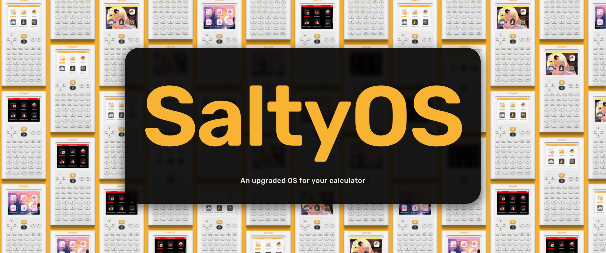
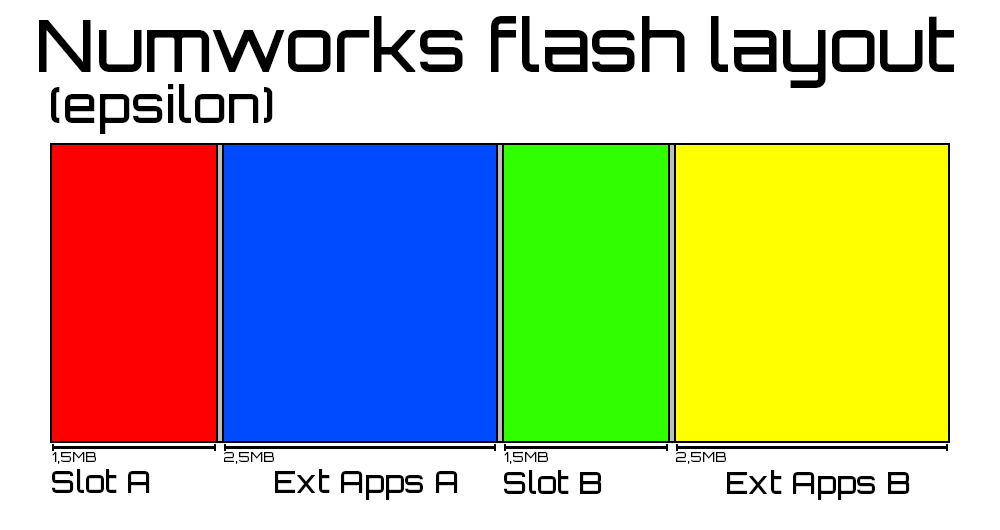
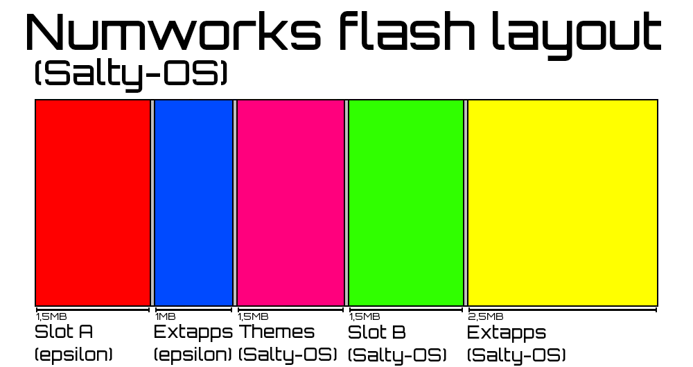
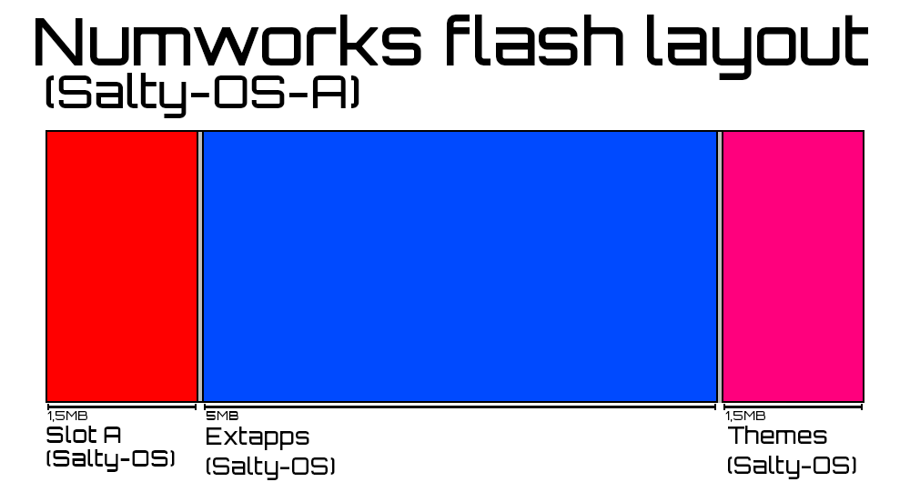

<p align="center">
  <a href="https://creativecommons.org/licenses/by-nc-sa/4.0/"></a>
  <a href="https://github.com/SaltyMold/Salty-OS/releases"></a>
  <br/>
  <a href="https://discord.gg/hpeW5Jud6p"></a>
  <a href="https://github.com/SaltyMold/Salty-OS"></a>
</p>

## Table of Contents
- [About](#about)
- [Features](#features)
- [How to install](#how-to-install)
- [How to use](#how-to-use)
- [How to build](#how-to-build)

## About

Salty-OS is a custom userland for the numworks calculator based on the latest published version of [epsilon](https://github.com/Numworks/epsilon) (26.1.0, branch `version-26`).
NumWorks calculators boot slot A by default, then you can access Slot B with a launcher (ex: [ABLaucher](https://github.com/SaltyMold/ABLauncher-Numworks)).
If the userland crashes or if you reset it, the calculator falls back to booting slot A, but slot B isn't wiped in the process, so the custom userland is still there and can be re-launched afterward.

Here are some example of the layout of the calculator flash:
<table>
  <thead>
    <tr>
      <th>Classic Epsilon</th>
      <th>SaltyOS on Slot B (locked calculator)</th>
      <th>SaltyOS on Slot A (unlocked calculator)</th>
    </tr>
  </thead>
  <tbody>
    <tr>
      <td></td>
      <td></td>
      <td></td>
    </tr>
  </tbody>
</table>

The pythons scripts are in ram, so the layout of the external flash can't affect them.
The bootloader is in another flash, the internal flash.

See more at https://nwagyu.org/reference/firmware/

## Features

The userland is build with a custom onboarding and external apps allowed.
It supports locked n0110, n0115, n0120 and also unlocked n0110 (It has not been tested on unlocked n0115 or n0120, but it could work.) with Epsilon kernel 26.4.0.

### Current

- Multiple themes simultaneously.
- A custom image wallpaper per theme.
- Custom icons per theme.
- Customizable icon form per theme.
- Custom color palette per theme.
- Toggle display of external apps.
- Salty-OS settings app (About and Themes), its information comes from the repository (Makefile, git, `themes/` folder) and from the Theme Area.
- Symbolic calculation
- French by default, and no Python script preinstalled.

Everything customizable via a website.

### Upcoming

Open a pull request if you want to add a feature.

## How to install

If you're unsure what to choose, choose locked calculator.

<details><summary><b>Locked calculator</b></summary>

### Userland

- Go on the [Salty-OS Website](https://salty-os.gabizar.top/install).
- Go to the [Install section](https://salty-os.gabizar.top/install).
- Follow the steps to install the userland on your calculator.

### Custom themes

- Go on the [Salty-OS Website](https://salty-os.gabizar.top/install).
- Go to the [Themes section](https://salty-os.gabizar.top/themes).
- Create your own theme or choose one of the existing themes from the community.

</details>

<details><summary><b>Unlocked calculator</b></summary>

### Flash Epsilon kernel

- Go to the [Upsilon installer](https://getupsilon.web.app/install).
- Connect your calculator.
- Choose "Custom binpack".
- Download epsilon kernel 26.4.0 from the official website with [this guide](https://nwagyu.org/reference/others/downloading-epsilon.html) or from the [archive](https://git.gabizar.top/GabiZar/Epsilon-Archive/releases/)
- Flash it at address `0x90000000` for slot A and `0x90400000` for slot B

### Userland

- Go to the [Upsilon installer](https://getupsilon.web.app/install).
- Connect your calculator.
- Choose "Custom binpack".
- Download SaltyOS from the [latest release](https://github.com/SaltyMold/Salty-OS/releases/latest)
- Flash it at address `0x90020000` for slot A and `0x90420000` for slot B

### Themes

- Go to the [Upsilon installer](https://getupsilon.web.app/install).
- Connect your calculator.
- Choose "Custom binpack".
- Create your themes with the python script `themes/generate_theme.py` of this repo.
- Flash `theme_area.bin` at `0x90670000` for slot A and at `0x90270000` for slot B.
</details>

## How to use

Every custom feature of the os has its own keybind.
It is always both parantheses and the keybind.

| Key   | Action        |
|-------|---------------|
| Shift | Previous theme    |
| Alpha | Next theme    |
| Xnt | Toggle external apps    |
| Backspace | Salty-OS settings |

## How to build

- Clone the repo.
```sh
git clone https://github.com/SaltyMold/Salty-OS
cd Salty-OS
```

- Activate the virtual environment.
```sh
python3 -m venv .venv
source .venv/bin/activate
```

- Install the dependencies.
```sh
# Use tools/setup.sh or adapt it to your system.
```

- Build the userland for n0120 for exemple.
```sh
make -j$(nproc) PLATFORM=n0120 EMBED_EXTRA_DATA=1 userland.onboarding.allow3rdparty.B.dfu
# With onboarding
# With 3rd party apps allowed
# For slot B
# With embedded extra data
```

- Flash the userland to the calculator.
```sh
python tools/device/dfu.py -D output/release/n0120/userland.onboarding.allow3rdparty.B.dfu -s 0x90420000
```
